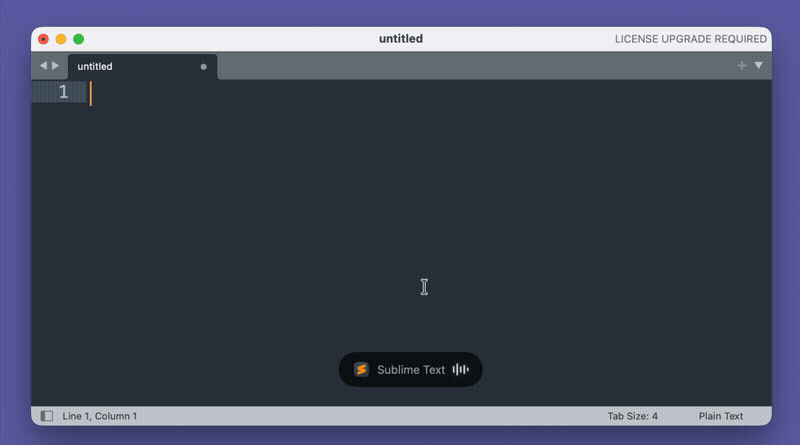

# Typester

A lightweight macOS menu bar app for speech-to-text dictation using [Soniox](https://soniox.com).



## What it does

Typester lives in your menu bar and lets you dictate text directly into any application. Hold a key to speak or toggle recording with a hotkey — your words are automatically typed into the active text field.

**Bring Your Own Key (BYOK)** — Typester connects directly to Soniox using your own API key. No middleman, no subscription, no data collection. You pay only for what you use directly to Soniox.

Features:
- **Press-to-speak** — Hold the Fn key to dictate, release to paste (default mode)
- **Toggle mode** — Or use a global hotkey to start/stop recording (triple-tap ⌘⌘⌘ or custom shortcut)
- **Real-time transcription** — Uses Soniox streaming API for low-latency speech recognition
- **60+ languages** — Auto-detects language, or select specific languages in the menu
- **Microphone selection** — Choose your preferred input device from the menu
- **Custom dictionary** — Add domain-specific words, names, or technical terms to improve accuracy
- **Auto-paste** — Transcribed text is automatically pasted into the active application
- **Secure API key storage** — Your Soniox API key is stored in the macOS Keychain
- **Launch at login** — Start automatically when you log in

## Requirements

- macOS 13 or later
- [Soniox](https://soniox.com) API key

## Permissions

Typester requires two macOS permissions:

- **Microphone** — needed to capture your voice for transcription. Without this, the app cannot hear you speak.

- **Accessibility** — needed to paste transcribed text into other applications. Typester simulates ⌘V to insert text at your cursor position. Without this, transcription works but text won't be pasted automatically.

## Installation

1. Download `Typester-x.x.x.dmg` from Releases
2. Open the DMG and drag Typester to Applications
3. Launch from Applications — it appears as an icon in your menu bar
4. Open Settings and enter your Soniox API key
5. Grant Microphone and Accessibility permissions when prompted

## Usage

**Press-to-speak mode (default):**
1. Hold the Fn key
2. Speak — your words are transcribed in real-time
3. Release Fn — text is pasted into the active field

**Toggle mode:**
1. Press triple-Cmd (⌘⌘⌘) or your custom hotkey to start
2. Speak — your words appear in the active text field
3. Press the hotkey again to stop

You can switch between modes in Settings. Use the menu bar to select your microphone, preferred languages, or access settings.

## Building from source

```bash
cd typester-macos
swift build
swift run
```

Requirements for building:
- Swift 5.9 or later
- Xcode Command Line Tools

## Architecture

```
Sources/
├── main.swift              # App entry point
├── AppDelegate.swift       # Status bar, menu, recording control
├── Models.swift            # Data models (ShortcutKeys, ActivationMode, etc.)
├── SettingsStore.swift     # UserDefaults + Keychain persistence
├── SettingsView.swift      # SwiftUI settings interface
├── OnboardingView.swift    # First-run setup wizard
├── HotkeyManager.swift     # Global hotkey registration (Carbon Events)
├── FnKeyMonitor.swift      # Fn key press-to-speak detection (CGEventTap)
├── AudioRecorder.swift     # AVAudioEngine microphone capture
├── SonioxClient.swift      # WebSocket streaming transcription
└── TextPaster.swift        # Clipboard + simulated Cmd+V paste
```

## Disclaimer

This project is not affiliated with, endorsed by, or sponsored by Soniox. Soniox is a third-party service used for speech recognition.

## License

MIT License

Copyright (c) 2026 Nick Ustinov

Permission is hereby granted, free of charge, to any person obtaining a copy
of this software and associated documentation files (the "Software"), to deal
in the Software without restriction, including without limitation the rights
to use, copy, modify, merge, publish, distribute, sublicense, and/or sell
copies of the Software, and to permit persons to whom the Software is
furnished to do so, subject to the following conditions:

The above copyright notice and this permission notice shall be included in all
copies or substantial portions of the Software.

THE SOFTWARE IS PROVIDED "AS IS", WITHOUT WARRANTY OF ANY KIND, EXPRESS OR
IMPLIED, INCLUDING BUT NOT LIMITED TO THE WARRANTIES OF MERCHANTABILITY,
FITNESS FOR A PARTICULAR PURPOSE AND NONINFRINGEMENT. IN NO EVENT SHALL THE
AUTHORS OR COPYRIGHT HOLDERS BE LIABLE FOR ANY CLAIM, DAMAGES OR OTHER
LIABILITY, WHETHER IN AN ACTION OF CONTRACT, TORT OR OTHERWISE, ARISING FROM,
OUT OF OR IN CONNECTION WITH THE SOFTWARE OR THE USE OR OTHER DEALINGS IN THE
SOFTWARE.
